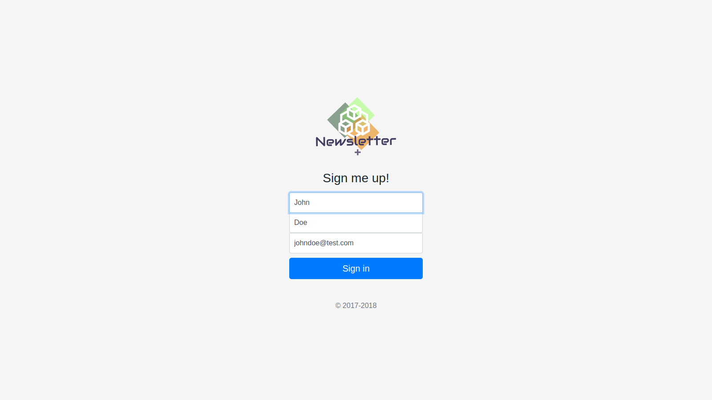

# Newsletter-Signup
Newsletter signup page wrote in node.js. Don't forget to change your API key and campaign url in the app.js file.

The info will be saved on Mailchimp:

To try it out you have to download express, bodyParser and request modules.
